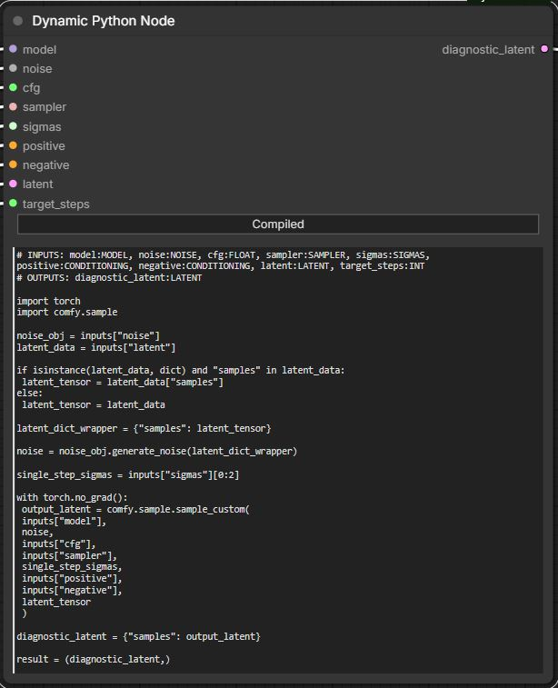

# ComfyUI Dynamic Python Node

Contains a single node for ComfyUI (https://github.com/comfyanonymous/ComfyUI) that allows writing and executing arbitrary python code inside of the ComfyUI graph, with support for dynamic input and output slots based on the code. No ComfyUI restart necessary. For safety reasons, a node must always be manually verified before the first run of a session.

To create input and output slots, put this at the top of your code text field:

# INPUTS: inputFieldNameA:IMAGE, inputFieldNameB:FLOAT
# OUTPUTS: outputFieldName:IMAGE

